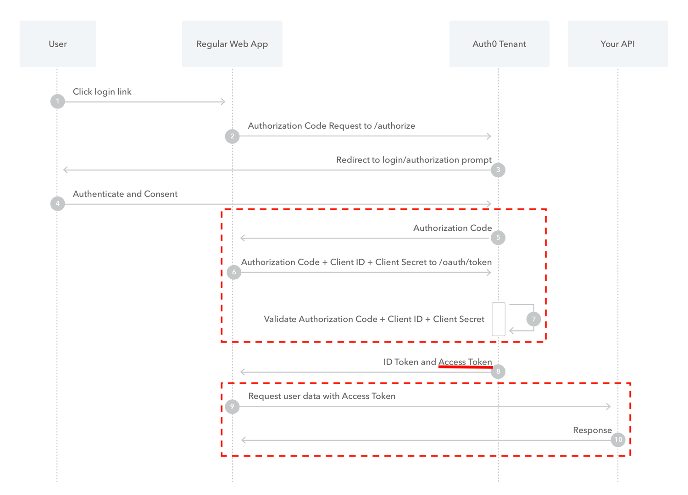
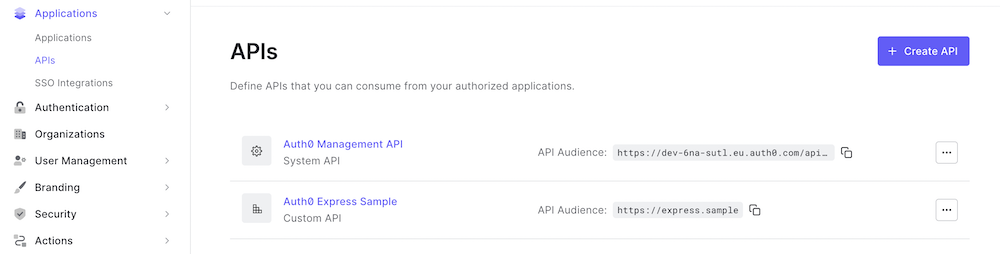

## Objectives

The main goal for this tech day was to better understand the sso login config and flow and get hands-on experience with user login via sso (using both Auth0 & Okta as the identity providers).

Other goals:

- figure out the differences between `Implicit Flow` (which is used in the MC) and `Authorization Code Flow`

- using `access_token` obtained in `Authorization Code Flow` for external APIs

(managing the secret on the client side was out of the scope, hence SSR UI)

## Outcomes

### Implementation

For my investigations I used 2 node apps:

- [Node client app providing Auth0 authentication and SSR UI](https://github.com/auth0-blog/auth0-express-pug-sample/)
- [Node app enabling secure external API calls from 👆](https://github.com/auth0-blog/auth0-express-js-sample)

Most basic setup and all concepts are also mentioned [here](https://github.com/auth0/express-openid-connect/blob/master/EXAMPLES.md)

### [Which OAuth 2.0 Flow Should I Use?](https://auth0.com/docs/get-started/authentication-and-authorization-flow/which-oauth-2-0-flow-should-i-use)

| [Authorization Code Flow](https://auth0.com/docs/get-started/authentication-and-authorization-flow/authorization-code-flow) | [Implicit Flow](https://auth0.com/docs/get-started/authentication-and-authorization-flow/implicit-flow-with-form-post) |
| --------------------------------------------------------------------------------------------------------------------------- | ---------------------------------------------------------------------------------------------------------------------- |
|                                                                                  |                                                                     |

In case of using `express-openid-connect` package:

- HTTP request object in case of `Implicit Flow` contains:

  ```properties
  isAuthenticated # boolean
  idToken # JWT containing in payload part `idTokenClaims`
  idTokenClaims # object containing user & issuer data
  user # object containing user data
  ```

- HTTP request object in case of `Authorization Code Flow` contains:

  ```properties
  isAuthenticated # boolean
  idToken # JWT in payload part contains `idTokenClaims`
  `accessToken` # another JWT containing in payload part issuer data + `audience`
  idTokenClaims # object containing user & issuer data
  user # object containing user data
  ```

### What are the benefits of `Authorization Code Flow` (= access to `accessToken`)

`accessToken` allows us to access secure routes of the external API which are configurable in the Auth0 panel:


Example of GET request handler using `Authorization` header:

```js
app.get("/external-api/protected-message", requiresAuth(), async (req, res) => {
  const { token_type, access_token } = req.oidc.accessToken;
  let message;

  try {
    const response = await fetch(
      `${process.env.SERVER_URL}/api/messages/protected-message`,
      {
        headers: {
          Authorization: `${token_type} ${access_token}`,
        },
      }
    );
    const body = await response.json();

    message = body.message;
  } catch (e) {
    message = "Unable to retrieve message.";
  }

  res.render("external-api", { message });
});
```

On the external API side:

```js
const messagesRouter = express.Router();
messagesRouter.get("/protected-message", checkJwt, (req, res) => {
  const message = getProtectedMessage();
  res.status(200).send(message);
});
```

where `checkJwt` is a route auth validator:

```js
const jwt = require("express-jwt");
const jwksRsa = require("jwks-rsa");
const { domain, audience } = require("../config/env.dev");

const checkJwt = jwt({
  secret: jwksRsa.expressJwtSecret({
    cache: true,
    rateLimit: true,
    jwksRequestsPerMinute: 5,
    jwksUri: `https://${domain}/.well-known/jwks.json`,
  }),

  audience: audience,
  issuer: `https://${domain}/`,
  algorithms: ["RS256"],
});

module.exports = {
  checkJwt,
};
```

### More links

[SSO](https://auth0.com/docs/authenticate/single-sign-on)
[OIDC](https://auth0.com/docs/authenticate/protocols/openid-connect-protocol)
[OAuth 2.0](https://auth0.com/docs/authenticate/protocols/oauth)
[MC docs](https://docs.commercetools.com/merchant-center/single-sign-on-beta)
