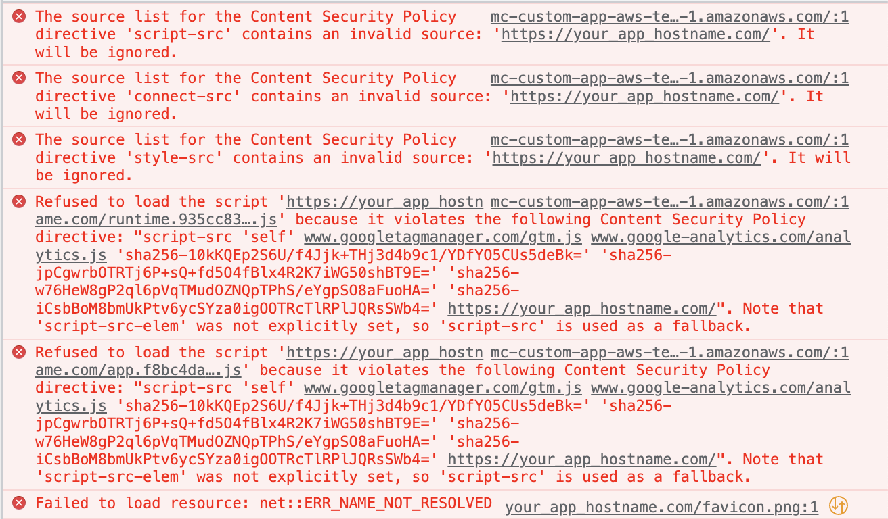
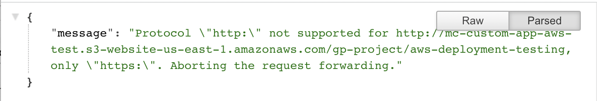
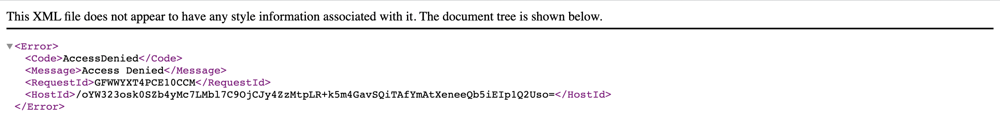

## Objectives

The idea was to recap on aws deplyments and get some context of deployments and any mc custom apps specific config.

## Outcomes

Errors that may occur on the way:

- app deployed to s3 but not configured in the MC
  

- a direct link to s3 bucket will not work, since only https is supported (so the best option is to have s3 bucket served via CloudFront)
  

- if uploading new content to s3 bucket and using CloudFront with caching - we need to be mindful about cache invalidations (need to be run manually against `/*`)

- in case of the error as below:
  
  custom error response must be added to CloudFront distribution configuration redirecting to `index.html`
  
- if any request are sent to API other than `https://mc-api.europe-west1.gcp.commercetools.com` the api url must be manually added to csp listed in the `index.html`

```html
<meta http-equiv="Content-Security-Policy" content="... API_URL " />
```

### Links

- https://wolovim.medium.com/deploying-create-react-app-to-s3-or-cloudfront-48dae4ce0af
- https://docs.aws.amazon.com/cli/latest/userguide/cli-services-s3-commands.html
