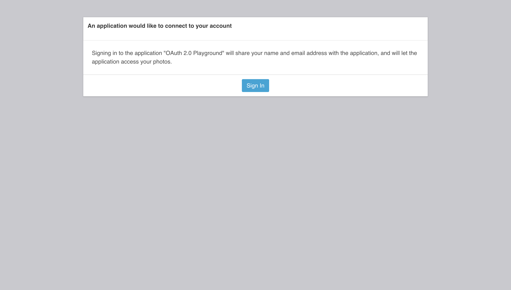

[Awesome OAuth & OIDC](https://github.com/shyuan/awesome-oauth-oidc)

[OAuth 2.0 RFC](https://datatracker.ietf.org/doc/html/rfc6749)

[OpenID Connect](https://openid.net/connect/)

## OAuth 2.0

OAuth 2.0, is a framework designed to support the development of authentication and authorization protocols. It provides a variety of standardized message flows based on JSON and HTTP; OpenID Connect uses these to provide Identity services.

OAuth 2.0 has itself no notion of identity, it is an Access Granting Protocol (giving permission in one application to access authorization context in another application). The most popular flow is authorization code flow.

## OIDC

**(Identity, Authentication) + OAuth 2.0 = OpenID Connect (OIDC is a thin identity layer on top of OAuth 2.0)**

OAuth 2.0 enables authorization from one app to another. OIDC enables a client to establish a login session (referred to as authentication) and to gain identity information about the person logged in.
The key difference, when compared to OAuth 2.0 authorization flow, is that when the client exchanges the authorization code (client id and client secret) for an access token **the client receives both the access token and an ID token**. ID token is a JWT that can be used by the client to extract identity claims.

OIDC is interoperable - which means:

- it has standard way of requesting and responding claims (so standard scopes were defined),
- a method to ask for more granular claims
- ID token - info about the authenticated user
- UserInfo endpoint - to get attributes about the user and translate the tokens

## [The concepts of JWT, JWS, JWE and JWK](https://belgianmobileid.github.io/slate/jose#:~:text=The%20concepts%20of%20JWT%2C%20JWS,using%20a%20variety%20of%20algorithms.)

## OAuth 2.0 implicit flow vs Authorization Code flow

> The primary reason the Implicit flow was created was because of an old limitation in browsers. It used to be the case that JavaScript could only make requests to the same server that the page was loaded from. However, the standard OAuth Authorization Code flow requires that a POST request is made to the OAuth server’s token endpoint, which is often on a different domain than the app. That meant there was previously no way to use this flow from JavaScript. The Implicit flow worked around this limitation by avoiding that POST request, and instead returning the access token immediately in the redirect.

> It’s worth noting that the Implicit flow has always been seen as a compromise compared to the Authorization Code flow. For example, the spec provides no mechanism to return a refresh token in the Implicit flow, as it was seen as too insecure to allow that. The spec also recommends short lifetimes and limited scope for access tokens issued via the Implicit flow.

Authorization Code flow uses a client secret when exchanging the **authorization code** for an **access token**, but there is **no way to include a client secret in a JavaScript app and have it remain a secret**. If you were to include a secret in the source code, anyone using the app could just “view source” in their browser and see it. So we need a solution.

This problem has already been solved with the PKCE (proof key code exchange) extension to the Authorization Code flow.

The Authorization Code flow with PKCE adds an additional step which allows us to protect the authorization code so that even if it is stolen during the redirect it will be useless by itself.

[OAuth 2.0 for Native and Mobile Apps](https://developer.okta.com/blog/2018/12/13/oauth-2-for-native-and-mobile-apps)

| OAuth Flow                   | Good for                                                        |
| ---------------------------- | --------------------------------------------------------------- |
| Implicit                     | Untrusted SPA apps (like Angular or Vue.js)                     |
| Authorization Code with PKCE | Untrusted Native or Mobile apps. PKCE = proof key code exchange |
| Authorization Code           | Trusted apps (like Spring Boot or .NET)                         |

The [Implicit flow](https://developer.okta.com/blog/2018/12/13/oauth-2-for-native-and-mobile-apps#why-not-implicit-flow) is typically used with SPA apps (untrusted) and returns a token directly to the browser. It’s a flow that gets your app a token in an untrusted environment without revealing any secrets. But it’s always had a dirty little secret (from a security perspective). Redirects are HTTP GETs. As such, your only opportunity to get a token back to the app is to include it in the URL. This is problematic from a security standpoint since the token is now sitting there in the browser history. It’s especially problematic if the token is long lived.

The [Authorization Code with PKCE](https://developer.okta.com/blog/2018/12/13/oauth-2-for-native-and-mobile-apps#authorization-code-with-pkce-flow) flow is typically used with native and mobile apps and returns tokens to this apps in a two part request flow. The most important difference here is that the only value being stored in browser history is the one-time use temporary authorization code. The tokens themselves are never passed through a URL. That’s because the last leg of the flow is a POST request and response.

The Authorization Code flow is meant for applications that have a browser component and a middleware component, like a Spring Boot application. This flow takes advantage of the redirect features built into the HTTP protocol that are automatically acted upon by your browser. When you first start the flow, you are redirected to an Authorization Server to authenticate. This is typically an external service provider, like Okta, that you trust to handle credentials securely. Assuming that authentication is successful, the authorization server will redirect back to your app (via the browser) with an `authorization code` in the URL. Your middleware application can use that code in conjunction with configuration information it’s stored called a client ID and a client secret to request tokens.

## Demo 1

https://oauth.tools/

### Implicit flow

### Authorization Code flow

### Authorization Code with PKCE flow

## Demo 2

https://www.oauth.com/playground/index.html

### Implicit flow

### Authorization Code flow

### Authorization Code with PKCE flow

### OpenID Connect

